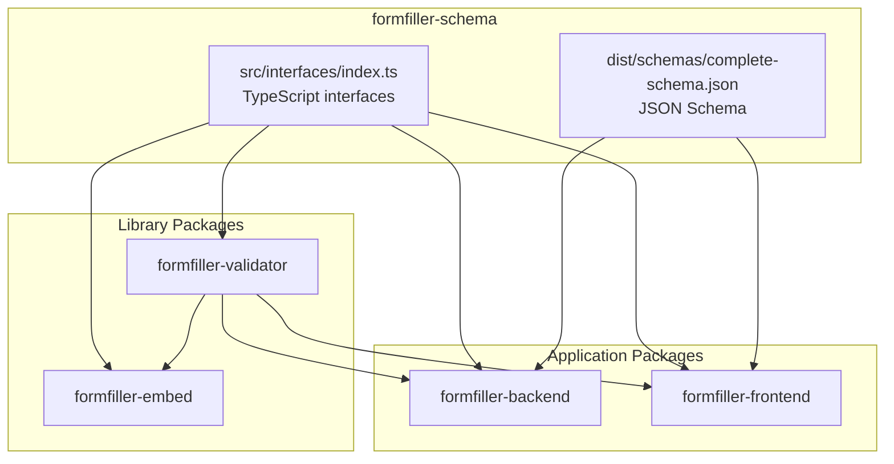
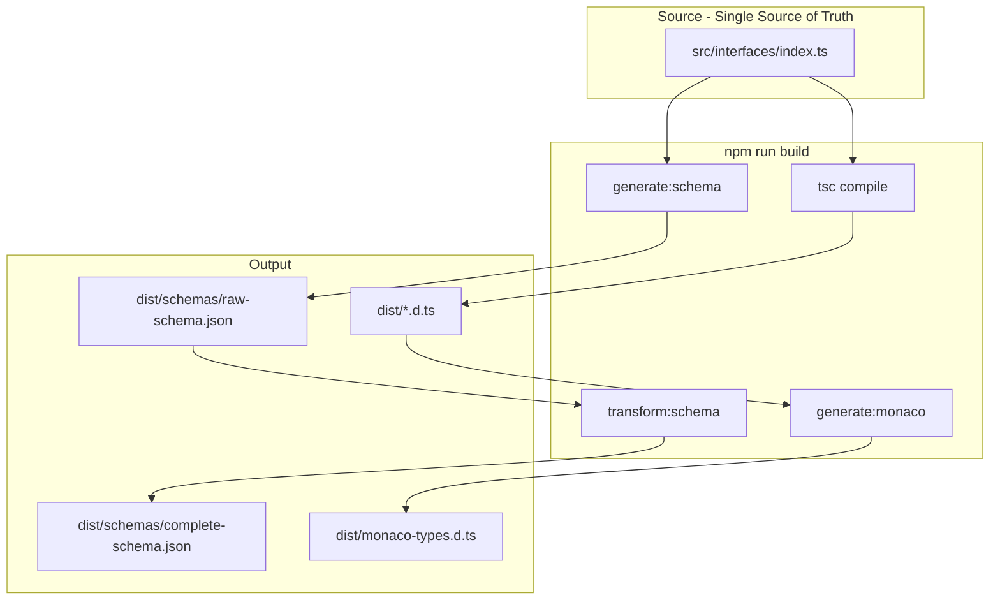
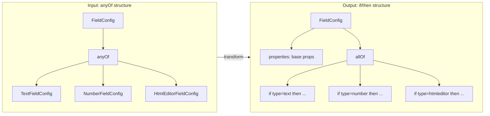
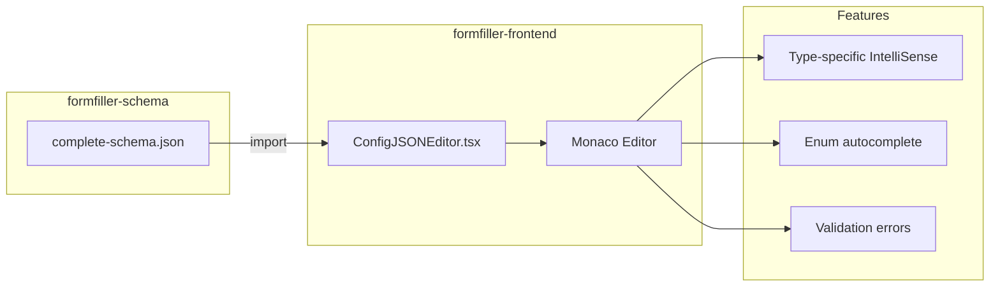
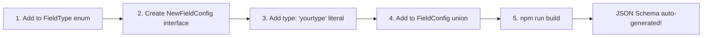
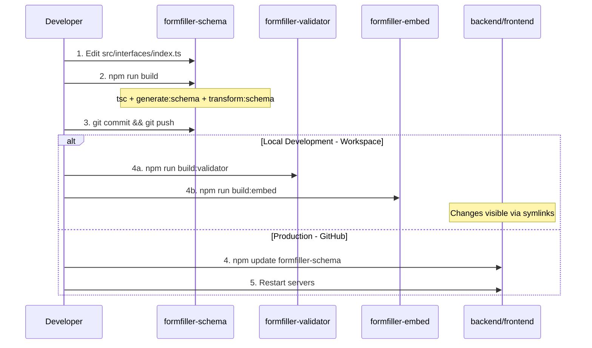

# FormFiller Schema

Shared schema definitions for the FormFiller application. Provides TypeScript types and JSON Schema validation for frontend, backend, and embed packages.

## Main Components

- **FieldConfig**: Field configurations (text, number, date, dropdown, htmleditor, etc.)
- **ItemConfig**: View configurations (grid, tree, form)
- **ValidationRule**: DevExtreme-compatible validation rules
- **SchemaValidator**: Multi-level validation with caching

## Package Dependencies

This package is a core dependency for multiple FormFiller repositories:



**Build order for libraries:**

```
formfiller-types → formfiller-schema → formfiller-validator → formfiller-embed
```

## Usage by Repository

| Repository | TypeScript Interfaces Used | complete-schema.json Usage |
|------------|---------------------------|---------------------------|
| **formfiller-frontend** | `FieldConfig`, `ViewConfig`, `ValidationRule`, `FieldType`, `LookupConfig` | Monaco editor IntelliSense in `ConfigJSONEditor.tsx` |
| **formfiller-backend** | `ItemConfig`, `FormPreferences`, `FieldConfig`, `ValidationRule` | AJV runtime validation in `configValidator.ts` |
| **formfiller-embed** | `ViewConfig`, `FieldConfig`, `FormPreferences`, `ValidationRuleOrGroup` | Not used directly |
| **formfiller-validator** | `ValidationRule`, `FieldConfig`, `ConditionalExpression`, `ComputedRule`, `CrossFieldType` | Not used directly |

### Import Examples

**Frontend (Monaco IntelliSense):**

```typescript
// TypeScript types
import { FieldConfig, ViewConfig } from 'formfiller-schema';

// JSON Schema for Monaco editor
import completeSchemaRaw from 'formfiller-schema/dist/schemas/complete-schema.json';
```

**Backend (AJV Validation):**

```typescript
// TypeScript types
import { ItemConfig, FieldConfig } from 'formfiller-schema';

// Schema for AJV validation
import { schemas } from 'formfiller-schema';
const { completeSchema } = schemas;
```

**Validator/Embed (Types only):**

```typescript
import { ValidationRule, ConditionalExpression } from 'formfiller-schema';
```

## Installation

### Production (GitHub)

```bash
npm install github:LowCoders/formfiller-schema
```

### Development (Workspace)

For local development, use [formfiller-dev-setup](https://github.com/LowCoders/formfiller-dev-setup) which symlinks all packages together:

```bash
cd /var/www/formfiller-dev-setup
./deploy.sh
cd /var/www
npm install
npm run build:libs
```

## Build Pipeline



The `npm run build` command executes:

1. **TypeScript compilation** - Compiles `src/` to `dist/`
2. **generate:schema** - Generates JSON Schema from TypeScript interfaces using `ts-json-schema-generator`
3. **transform:schema** - Transforms FieldConfig from `anyOf` to `if/then/allOf` for Monaco IntelliSense
4. **generate:monaco** - Bundles TypeScript definitions for Monaco editor

## Scripts

| Script | Description |
|--------|-------------|
| `build` | Full build pipeline (tsc + schema generation + transform + monaco types) |
| `generate:schema` | Generates JSON Schema from TypeScript interfaces |
| `transform:schema` | Transforms `anyOf` to `if/then/allOf` structure for Monaco |
| `generate:monaco` | Bundles `.d.ts` files into `monaco-types.d.ts` |
| `build:legacy` | Legacy build using manual schema (fallback) |
| `test` | Run Jest tests |

### generate-schema.ts

Generates JSON Schema from TypeScript interfaces using `ts-json-schema-generator`:

- Reads `src/interfaces/index.ts`
- Outputs `dist/schemas/raw-schema.json`
- Preserves JSDoc comments as descriptions
- Creates `anyOf` structures for union types

### transform-schema.ts

Transforms the generated JSON Schema for better Monaco editor IntelliSense:



**Input (anyOf structure from generator):**

```json
{
  "FieldConfig": {
    "anyOf": [
      { "$ref": "#/definitions/TextFieldConfig" },
      { "$ref": "#/definitions/HtmlEditorFieldConfig" }
    ]
  }
}
```

**Output (if/then/allOf structure):**

```json
{
  "FieldConfig": {
    "properties": { /* base properties from BaseFieldConfig */ },
    "allOf": [
      {
        "if": { "properties": { "type": { "const": "htmleditor" } } },
        "then": { "properties": { "toolbar": {...}, "mediaResizing": {...} } }
      }
    ]
  }
}
```

This allows Monaco to show type-specific properties based on the `type` field value.

### generate-monaco-types.ts

Collects all TypeScript definition files from `dist/` and bundles them into a single `monaco-types.d.ts` file for Monaco editor TypeScript IntelliSense.

## Monaco Integration



The frontend `ConfigJSONEditor.tsx` imports the transformed schema:

```typescript
import completeSchemaRaw from 'formfiller-schema/dist/schemas/complete-schema.json';
```

Key features:
- Type-specific IntelliSense via `if/then` blocks
- Enum values for autocomplete (e.g., toolbar item names: `bold`, `italic`, `header`, etc.)
- Validation errors shown in editor

## Modifying the Schema

The TypeScript interfaces in `src/interfaces/index.ts` are the **Single Source of Truth**. The JSON Schema is automatically generated from them.

1. **Edit TypeScript types**: `src/interfaces/index.ts`
2. **Build**: `npm run build`
3. **Test in Monaco**: Restart frontend dev server and verify IntelliSense

### Adding a new field type



1. Add the type to `FieldType` enum in `src/interfaces/index.ts`
2. Create `NewFieldConfig` interface extending `BaseFieldConfig`
3. Add `type: 'yourtype'` literal property to the interface
4. Add to `FieldConfig` union type
5. Build and test - JSON Schema is auto-generated!

### Adding properties with enum values

For Monaco autocomplete to work with enum values:

```json
{
  "propertyName": {
    "type": "string",
    "enum": ["value1", "value2", "value3"],
    "description": "Description for IntelliSense"
  }
}
```

## Development Workflow

### Schema Modification Flow



### Local Development (Recommended)

Using [formfiller-dev-setup](https://github.com/LowCoders/formfiller-dev-setup) workspace:

```bash
# 1. Edit the schema
cd /var/www/formfiller-schema
# ... make changes to src/interfaces/index.ts ...

# 2. Build schema
npm run build

# 3. Rebuild dependent libraries
cd /var/www
npm run build:libs   # Builds: types → schema → validator → embed

# 4. Test in apps
# Frontend: refresh browser (Vite hot-reloads)
# Backend: restart if running
```

### Production Deployment

For production environments where packages are installed from GitHub:

**Option A: Using sync-dependents.sh (automated)**

```bash
cd /var/www/formfiller-schema

# Build, commit, push, and update all dependent projects
./sync-dependents.sh

# With options:
DRY_RUN=true ./sync-dependents.sh      # Preview only
AUTO_RESTART=true ./sync-dependents.sh  # Restart backend automatically
SKIP_PUSH=true ./sync-dependents.sh     # Skip git push (local testing)
```

**Option B: Manual update**

```bash
# 1. Build and push schema
cd /var/www/formfiller-schema
npm run build
git add -A && git commit -m "chore: update schema"
git push

# 2. Update dependent projects
cd /var/www/formfiller-backend
npm update formfiller-schema formfiller-validator
npm run build

cd /var/www/formfiller-frontend
npm update formfiller-schema formfiller-validator

# 3. Restart servers
```

### sync-dependents.sh Script

The `sync-dependents.sh` script automates the schema update process for GitHub-based deployments:

| Step | Action |
|------|--------|
| 1 | Build formfiller-schema (`npm run build`) |
| 2 | Commit and push changes to GitHub |
| 3 | Update backend (`npm update formfiller-schema formfiller-validator formfiller-types`) |
| 4 | Rebuild backend |
| 5 | Update frontend packages |
| 6 | Verify installation |

**Environment Variables:**

| Variable | Default | Description |
|----------|---------|-------------|
| `DRY_RUN` | `false` | Preview mode - no actual changes |
| `AUTO_RESTART` | `false` | Automatically restart backend server |
| `SKIP_PUSH` | `false` | Skip git push (for local testing) |

## Quick Start

```typescript
import { FieldConfig, ItemConfig } from 'formfiller-schema';

const myField: FieldConfig = {
  name: 'description',
  label: 'Description',
  type: 'htmleditor',
  toolbar: {
    items: ['bold', 'italic', 'header', 'separator', 'orderedList', 'bulletList']
  }
};
```

## Detailed Documentation

Full documentation: [formfiller-docs](https://lowcoders.github.io/formfiller-docs/)

## License

MIT
